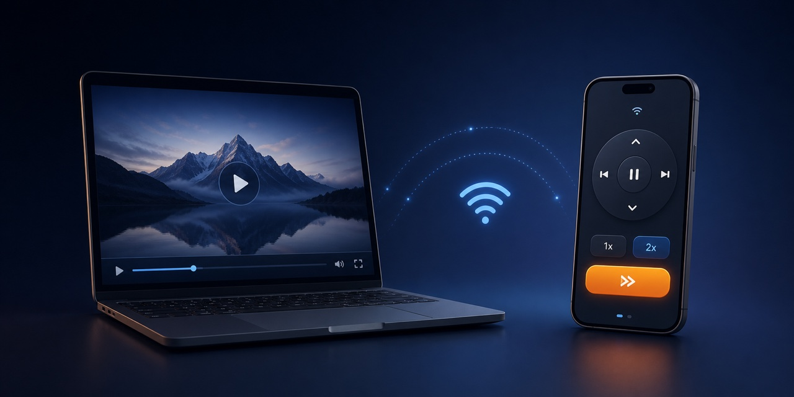
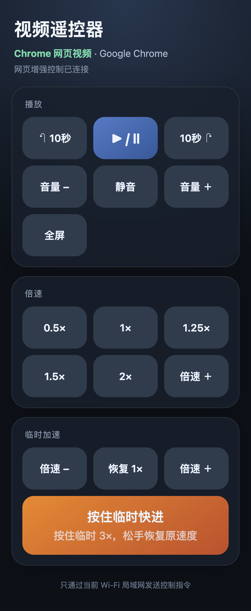

# Mac Video Remote

简体中文 · [English](README.md)



**通过同一 Wi-Fi，用 iPhone 控制 Mac 上的视频播放。** 支持播放暂停、快进快退、倍速、音量、全屏，以及“按住临时快进”；iPhone 无需安装 App。

> 这是公开源代码展示项目，不是开源项目。作者保留版权；未经许可不得复制、修改、分发或商业使用。许可允许个人以非商业目的运行未经修改的软件，详情见 [LICENSE.md](LICENSE.md)。

## 它解决什么问题

当 Mac 离座位有一点距离时，暂停视频或修改倍速都需要站起来。Mac Video Remote 把 iPhone Safari 变成一个专注的视频遥控器，控制 Mac 当前最前面的应用。

## 主要功能

- 播放暂停、前后跳转、全屏、静音和系统音量
- 网页增强模式提供 0.5×、1×、1.25×、1.5×、2×及逐级倍速
- 手指按住时临时快进：网页使用临时 3×，客户端使用持续右方向键
- 自动识别抖音、小红书、夸克和哔哩哔哩客户端
- 自动识别 Safari、Chrome、Edge、Arc、Brave 和 Firefox
- 可选 Chromium 扩展直接控制网页 `<video>`；未安装时自动使用通用按键
- 无云端、无账号、无统计分析、无第三方运行依赖
- 局域网配对码保护
- 使用公开的 macOS `CGEvent` 与辅助功能 API

## 真实手机界面

<p align="center">
  
</p>

页面顶部会根据 Mac 当前最前面的应用自动显示应用名称和控制配置。

## 系统要求

- Apple 芯片 Mac，macOS 13 或更高版本
- Mac 和 iPhone 连接同一个可信 Wi-Fi
- Python 3 与 Apple Clang 命令行工具
- 给 Terminal 辅助功能权限

## 启动方法

在 Finder 中双击：

```text
启动视频遥控器.command
```

也可以在终端运行：

```bash
cd "/path/to/mac-video-remote"
./scripts/run.sh
```

第一次启动：

1. 打开“系统设置 → 隐私与安全性 → 辅助功能”。
2. 允许 Terminal 控制 Mac，然后重新启动服务。
3. 保持终端窗口开启。
4. 在 iPhone Safari 打开终端显示的完整网址。
5. 在 Safari 分享菜单中选择“添加到主屏幕”。

配对码只在第一次运行时生成，保存在：

```text
~/Library/Application Support/MacVideoRemote/pairing-code
```

文件权限为 `0600`，只有当前 Mac 用户可以读取。网页配对成功后会自动从地址栏隐藏配对码。

## 使用前的准备

1. 打开夸克、哔哩哔哩或视频网页。
2. 开始播放视频。
3. 点击一下视频画面，让播放器获得键盘焦点。
4. 保持视频应用或浏览器在最前面。
5. 再使用 iPhone 遥控。

遥控指令会发送给 Mac 当前最前面的应用。如果你切换到其他软件，按键也会发送给新的前台应用。

## 网页视频增强控制（推荐）

只用通用按键时，网页需要先点击播放器，而且不同网站的倍速快捷键并不统一。项目内附的本地 Chromium 扩展会直接控制网页中的视频，适用于 Chrome、Edge，以及能够加载 Chromium 扩展的浏览器。

安装步骤：

1. 先启动视频遥控器，记下终端中的六位配对码。
2. Chrome 打开 `chrome://extensions`；Edge 打开 `edge://extensions`。
3. 开启“开发者模式”。
4. 点击“加载已解压的扩展程序”。
5. 选择项目中的整个 `browser-extension` 文件夹。
6. 打开扩展的“详细信息 → 扩展程序选项”。
7. 输入六位配对码并保存，然后刷新视频网页。

连接成功后，手机顶部会显示“网页增强控制已连接”。此时播放、前后10秒、静音、精确倍速和按住临时3×由网页扩展执行；系统音量和全屏仍使用 Mac 控制。

完整说明见 [browser-extension/README.md](browser-extension/README.md)。Safari 和不允许加载扩展的客户端仍使用通用按键模式。

## 按钮说明

| 手机按钮 | Mac 指令 | 说明 |
| --- | --- | --- |
| 播放 / 暂停 | 空格 | 大多数播放器支持 |
| 前后跳转 | 左 / 右方向键 | 秒数由播放器决定 |
| 按住临时快进 | 网页临时3×；客户端持续发送右方向键 | 服务器设有自动释放保险 |
| 网页精确倍速 | 直接设置 HTML5 视频播放速度 | 需要网页增强扩展 |
| 客户端 1× / 2× | Shift+1 / Shift+2 | 哔哩哔哩配置；其他客户端按实际支持显示 |
| 全屏 / 静音 | F / M | 播放器需要获得键盘焦点 |
| 音量 | Mac 系统音量 | 不依赖播放器快捷键 |

## 隐私与安全

- 不连接云端，不上传浏览记录或播放内容。
- 配对码文件只有当前用户可读。
- 服务端使用恒定时间比较配对码。
- 长按设有自动释放，避免断网时方向键卡住。
- 局域网通信使用普通 HTTP，因此只应在可信 Wi-Fi 中运行。
- 不要公开包含配对码的控制网址。

更完整的安全边界见 [SECURITY.md](SECURITY.md)。

## 当前边界

- 长按临时快进依赖播放器支持长按右方向键。
- 固定倍速由播放器快捷键决定；播放器升级后可能需要更新配置。
- 抖音和小红书客户端当前提供播放、跳转、静音、全屏、音量和临时快进；没有暴露可靠的固定倍速快捷键。
- Safari 无法直接加载这里的 Chromium 扩展，因此使用通用按键模式。
- 当前版本通过终端运行，尚未打包成签名的菜单栏 App。
- Mac 睡眠或终端服务停止后，iPhone 无法继续连接。

## 开发与测试

```bash
./scripts/build.sh
PYTHONPYCACHEPREFIX=/tmp/mac-video-remote-pycache \
  python3 -m unittest discover -s Tests -v
```

项目结构见 [docs/ARCHITECTURE.md](docs/ARCHITECTURE.md)，更新记录见 [CHANGELOG.md](CHANGELOG.md)。

如果使用 Google AI Studio 展示项目，请先阅读 [docs/AI_STUDIO.md](docs/AI_STUDIO.md)。AI Studio 适合作为安装引导页，不能替代需要 macOS 辅助功能权限的本机控制服务。

## 版权与许可

Copyright © 2026 `liw10152-vanessa`. All rights reserved.

本项目公开源代码用于查看、评估和个人作品展示。许可允许个人以非商业目的运行未经修改的软件；未经书面许可，不得重新分发、制作衍生作品、再许可或商业使用。完整条款见 [LICENSE.md](LICENSE.md)。

本项目为独立作品，与 Apple、哔哩哔哩或夸克不存在隶属、授权、赞助或背书关系。相关名称仅用于说明兼容性。
